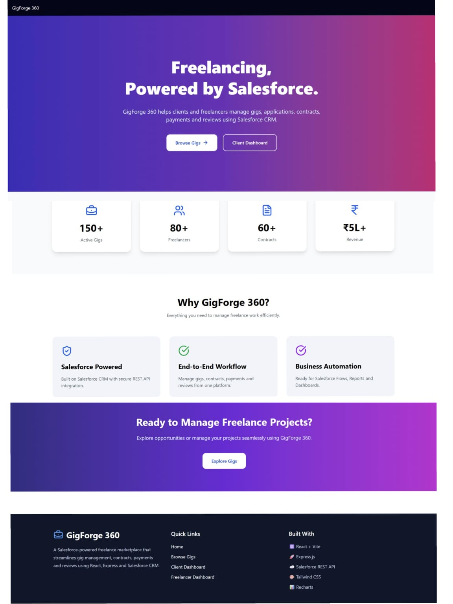
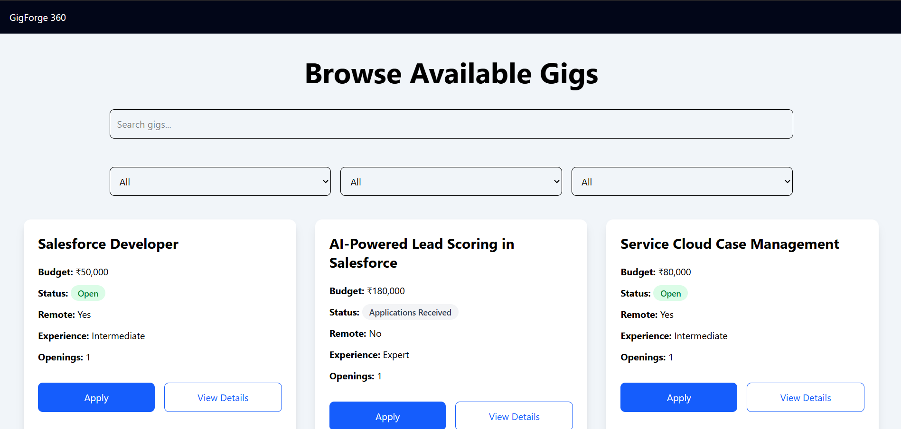
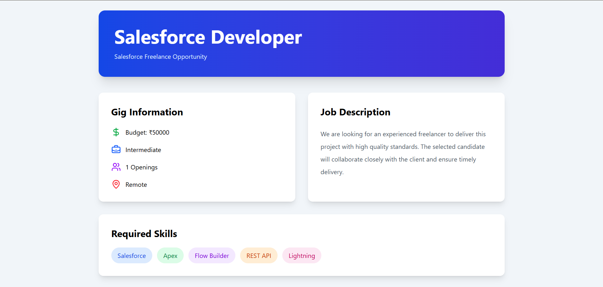
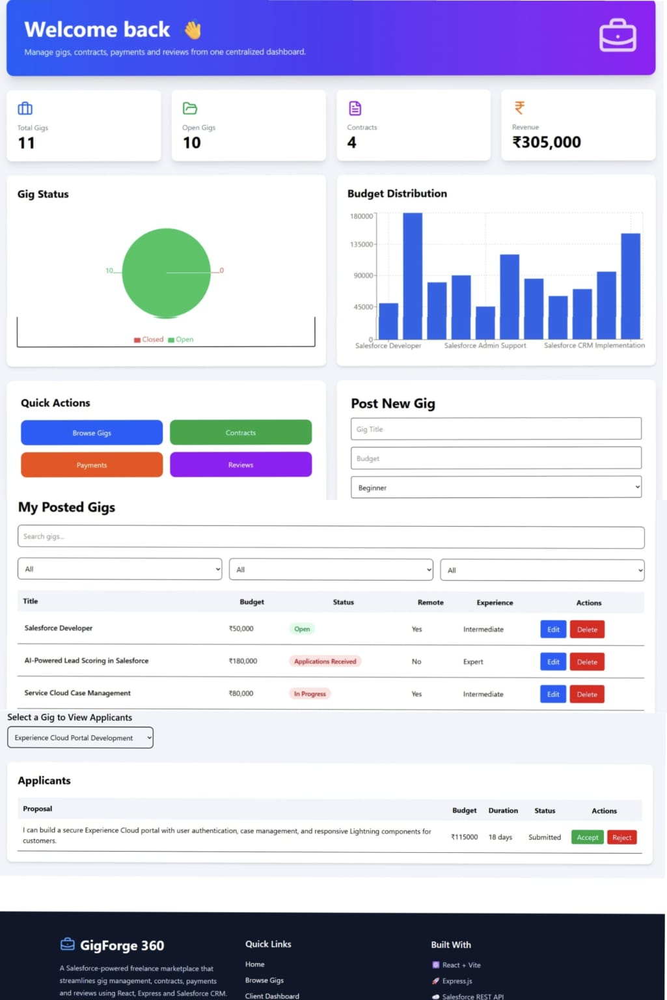
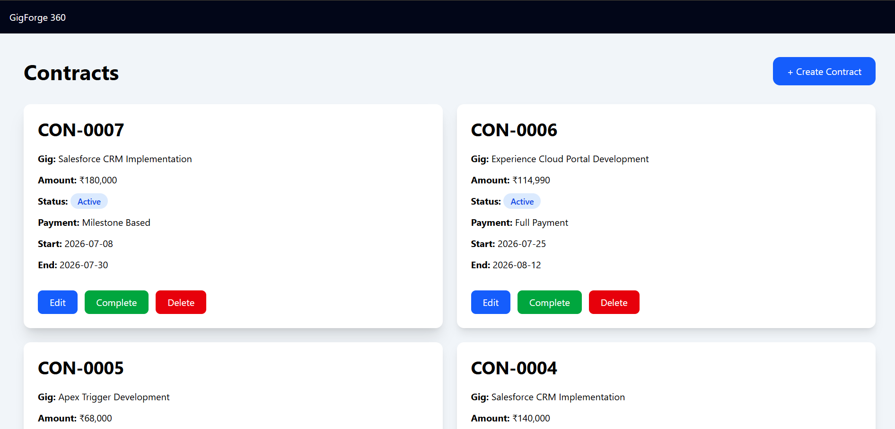
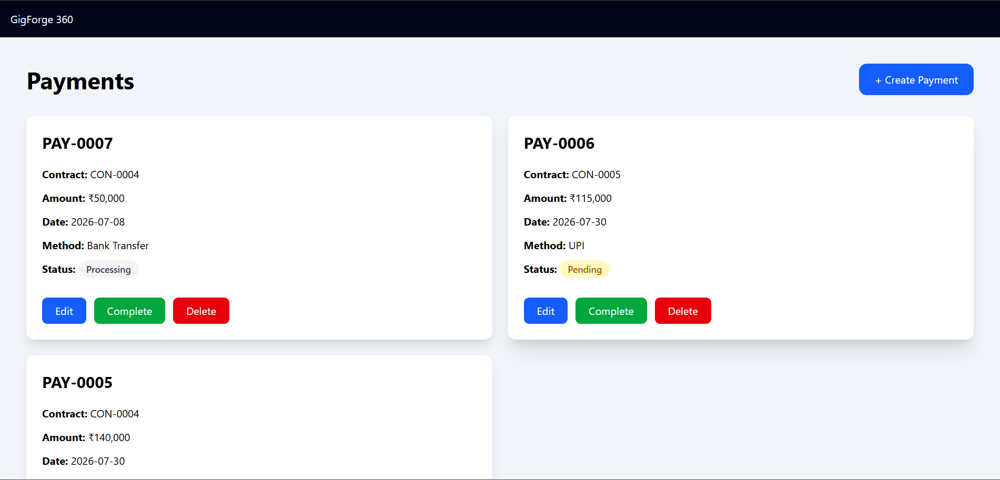
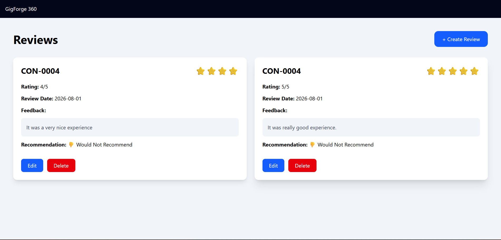

# 🚀 GigForge 360

### Salesforce-Powered Freelance Marketplace

GigForge 360 is a full-stack freelance marketplace built using **React**, **Express.js**, and **Salesforce CRM**. The platform enables clients and freelancers to manage the complete freelance lifecycle—from posting gigs and submitting applications to managing contracts, payments, and reviews—all through a modern web interface backed by Salesforce.

Designed with scalability and business automation in mind, GigForge 360 leverages Salesforce Custom Objects and REST APIs to provide a centralized, cloud-based solution for freelance project management.


## 📖 Project Overview

Freelancing has become a preferred way for businesses to access specialized talent and for professionals to work on flexible projects. However, managing freelance engagements often involves multiple disconnected tools for job posting, applications, contracts, payments, and reviews, leading to fragmented workflows and inefficient project management.

**GigForge 360** addresses this challenge by providing a centralized, Salesforce-powered freelance marketplace where clients and freelancers can seamlessly collaborate throughout the entire project lifecycle. The platform combines an intuitive React-based user interface with the power of Salesforce CRM, enabling secure data management, streamlined business processes, and real-time record synchronization through REST APIs.

From posting freelance opportunities to managing applications, contracts, payments, and reviews, GigForge 360 demonstrates how Salesforce can be leveraged beyond traditional CRM use cases to build modern, business-centric web applications.

## ✨ Key Highlights

- 📌 **End-to-End Freelance Workflow** – Manage the complete freelance lifecycle, including gig posting, applications, contracts, payments, and reviews from a single platform.

- ☁️ **Salesforce CRM Integration** – Leverages Salesforce Custom Objects and REST APIs to securely manage and synchronize business data in real time.

- 🔄 **Complete CRUD Functionality** – Supports creating, viewing, updating, and deleting records across multiple business modules.

- 📊 **Interactive Analytics Dashboard** – Visualizes key business metrics using dynamic charts and statistics for better decision-making.

- 🔍 **Smart Gig Discovery** – Browse, search, and filter freelance opportunities based on project requirements and experience levels.

- 📄 **Contract & Payment Management** – Streamlines project agreements and payment tracking to ensure transparency throughout the project lifecycle.

- ⭐ **Review & Rating System** – Enables clients to provide feedback, promoting trust and accountability within the platform.

- 🎨 **Modern Responsive Interface** – Built with React and Tailwind CSS to provide a clean, responsive, and user-friendly experience across devices.

- 🚀 **Cloud Deployed** – Frontend deployed on Vercel and backend deployed on Render, demonstrating a production-style deployment workflow.

## 🛠️ Technology Stack

### Frontend

- **React 19** – Component-based user interface development
- **Vite** – Fast build tool and development server
- **Tailwind CSS** – Utility-first CSS framework for responsive design
- **React Router DOM** – Client-side routing and navigation
- **Axios** – HTTP client for REST API communication
- **Recharts** – Interactive data visualization and analytics
- **React Hot Toast** – User-friendly notification system
- **Lucide React** – Modern icon library

---

### Backend

- **Node.js** – JavaScript runtime environment
- **Express.js** – RESTful API development
- **Axios** – Communication with Salesforce REST APIs
- **CORS** – Cross-Origin Resource Sharing
- **Dotenv** – Secure environment variable management

---

### Salesforce

- **Salesforce CRM**
- **Salesforce REST API**
- **OAuth 2.0 Client Credentials Flow**
- **Custom Objects**
  - Gig__c
  - Application__c
  - Contract__c
  - Payment__c
  - Review__c

---

### Data Visualization

- Interactive Dashboard
- Status Distribution Charts
- Budget Analytics
- Business Insights

---

### Deployment

- **Frontend:** Vercel
- **Backend:** Render
- **Version Control:** Git & GitHub

## 🏗️ System Architecture

GigForge 360 follows a modern three-tier architecture where the React frontend communicates with an Express.js backend through REST APIs. The backend authenticates with Salesforce using OAuth 2.0 Client Credentials Flow and performs CRUD operations on Salesforce Custom Objects.

```text
                         User
                           │
                           ▼
                ┌─────────────────────┐
                │   React + Vite UI   │
                │      (Frontend)     │
                │      Vercel         │
                └─────────┬───────────┘
                          │
                     Axios REST API
                          │
                          ▼
                ┌─────────────────────┐
                │    Express.js API   │
                │      (Backend)      │
                │       Render        │
                └─────────┬───────────┘
                          │
          OAuth 2.0 Client Credentials Flow
                          │
                Salesforce REST API
                          │
                          ▼
              ┌──────────────────────────┐
              │     Salesforce CRM       │
              │                          │
              │ • Gig__c                │
              │ • Application__c        │
              │ • Contract__c           │
              │ • Payment__c            │
              │ • Review__c             │
              └──────────────────────────┘
```

### Application Workflow

1. The user interacts with the React frontend.
2. The frontend sends REST API requests to the Express.js backend using Axios.
3. The backend authenticates with Salesforce using OAuth 2.0 Client Credentials Flow.
4. Business operations are executed on Salesforce Custom Objects through the Salesforce REST API.
5. The backend returns the processed data to the frontend.
6. The frontend updates the user interface in real time.

## 📸 Application Screenshots

The following screenshots demonstrate the key functionalities and user interface of GigForge 360.

### 🏠 Home Page

> Landing page showcasing the platform overview, key features, statistics, and call-to-action.



---

### 💼 Browse Gigs

> Browse available freelance opportunities with search and filtering capabilities.



---

### 📋 Gig Details & Application

> View detailed gig information and submit proposals with estimated budget and timeline.



---

### 📊 Client Dashboard

> Interactive dashboard displaying business insights, analytics, recent gigs, and quick actions.



---

### 📄 Contracts Management

> Create and manage freelancer contracts throughout the project lifecycle.



---

### 💳 Payments Management

> Track payment status, payment history, and manage freelancer payments.



---

### ⭐ Reviews & Ratings

> Review completed projects and provide ratings to freelancers.



---

## 📂 Project Structure

```text
GigForge360
│
├── gigforge-backend/              # Express.js backend
│   ├── controllers/               # Business logic
│   ├── middleware/                # Middleware functions
│   ├── models/                    # Data models
│   ├── routes/                    # API routes
│   ├── services/                  # Salesforce integration
│   ├── config/                    # Configuration files
│   └── server.js                  # Backend entry point
│
├── src/
│   ├── assets/                    # Images & static assets
│   ├── components/
│   │   ├── charts/                # Dashboard charts
│   │   ├── common/                # Reusable UI components
│   │   ├── contracts/             # Contract components
│   │   ├── dashboard/             # Dashboard components
│   │   ├── gig/                   # Gig-related components
│   │   ├── layout/                # Navbar & Footer
│   │   ├── payments/              # Payment components
│   │   └── reviews/               # Review components
│   │
│   ├── hooks/                     # Custom React hooks
│   ├── pages/                     # Application pages
│   ├── services/                  # API service layer
│   ├── App.jsx
│   └── main.jsx
│
├── public/                        # Static assets
├── README.md
└── package.json
```

## ⚙️ Installation & Setup

### Prerequisites

Before running the project, ensure you have the following installed:

- Node.js (v18 or later)
- npm
- Git
- Salesforce Developer Org
- Connected App configured in Salesforce

---

### 1. Clone the Repository

```bash
git clone https://github.com/akankshac2309/GigForge360.git

cd GigForge360
```

---

### 2. Install Frontend Dependencies

```bash
npm install
```

---

### 3. Install Backend Dependencies

```bash
cd gigforge-backend

npm install
```

---

### 4. Configure Environment Variables

Create a `.env` file inside the `gigforge-backend` directory and configure the following variables:

```env
SF_LOGIN_URL=
SF_CLIENT_ID=
SF_CLIENT_SECRET=
PORT=
```

Create a `.env` file in the project root for the frontend:

```env
VITE_API_URL=
```

> **Note:** Do not commit `.env` files or sensitive credentials to version control.

---

### 5. Start the Backend

```bash
cd gigforge-backend

npm start
```

The backend will run on:

```
http://localhost:5000
```

---

### 6. Start the Frontend

Open another terminal and run:

```bash
npm run dev
```

The frontend will be available at:

```
http://localhost:5173
```

---

### 7. Access the Application

Open your browser and navigate to:

```
http://localhost:5173
```

The frontend will communicate with the Express.js backend, which securely interacts with Salesforce CRM through REST APIs.

## 📡 REST API Endpoints

The Express.js backend exposes RESTful APIs that communicate with Salesforce CRM using the Salesforce REST API.

### Gig Management

| Method | Endpoint | Description |
|--------|----------|-------------|
| GET | `/api/gigs` | Retrieve all gigs |
| POST | `/api/gigs` | Create a new gig |
| PUT | `/api/gigs/:id` | Update an existing gig |
| DELETE | `/api/gigs/:id` | Delete a gig |

---

### Applications

| Method | Endpoint | Description |
|--------|----------|-------------|
| GET | `/api/applications` | Retrieve all applications |
| GET | `/api/applications/:gigId` | Retrieve applications for a specific gig |
| POST | `/api/applications` | Submit a gig application |
| PUT | `/api/applications/:id` | Update application status |

---

### Contracts

| Method | Endpoint | Description |
|--------|----------|-------------|
| GET | `/api/contracts` | Retrieve all contracts |
| POST | `/api/contracts` | Create a contract |
| PUT | `/api/contracts/:id` | Update a contract |
| DELETE | `/api/contracts/:id` | Delete a contract |

---

### Payments

| Method | Endpoint | Description |
|--------|----------|-------------|
| GET | `/api/payments` | Retrieve all payments |
| POST | `/api/payments` | Create a payment |
| PUT | `/api/payments/:id` | Update a payment |
| DELETE | `/api/payments/:id` | Delete a payment |

---

### Reviews

| Method | Endpoint | Description |
|--------|----------|-------------|
| GET | `/api/reviews` | Retrieve all reviews |
| POST | `/api/reviews` | Create a review |
| PUT | `/api/reviews/:id` | Update a review |
| DELETE | `/api/reviews/:id` | Delete a review |

---

### Dashboard

| Method | Endpoint | Description |
|--------|----------|-------------|
| GET | `/api/dashboard/client` | Retrieve client dashboard analytics |


## ☁️ Salesforce CRM Integration

GigForge 360 is built around **Salesforce CRM**, which serves as the primary data management platform for the application. Instead of using a traditional relational database, all business data is stored and managed using **Salesforce Custom Objects**, demonstrating how Salesforce can be leveraged as a scalable backend for modern web applications.

The Express.js backend communicates with Salesforce through the **Salesforce REST API**, while authentication is securely handled using the **OAuth 2.0 Client Credentials Flow**. This architecture enables real-time synchronization of business data between the web application and Salesforce.

### Salesforce Custom Objects

The application uses the following custom objects:

| Custom Object | Purpose |
|--------------|---------|
| **Gig__c** | Stores freelance job postings created by clients |
| **Application__c** | Stores freelancer applications and proposals |
| **Contract__c** | Manages project agreements between clients and freelancers |
| **Payment__c** | Tracks project payments and payment status |
| **Review__c** | Stores project feedback and freelancer ratings |

---

### Key Salesforce Capabilities

- Secure authentication using **OAuth 2.0 Client Credentials Flow**
- Real-time CRUD operations through the **Salesforce REST API**
- Centralized business data management using Salesforce CRM
- Custom object relationships for structured data organization
- Extensible architecture compatible with Salesforce automation features such as Flows, Reports, and Dashboards

---

### Business Value

Using Salesforce as the backend enables GigForge 360 to combine a modern React-based user experience with enterprise-grade CRM capabilities. This approach provides secure data management, scalability, and the flexibility to extend the platform using Salesforce's automation and reporting features in future iterations.


## 🚀 Deployment

GigForge 360 follows a cloud-based deployment architecture to simulate a production-ready environment.

### Frontend

- **Platform:** Vercel
- **Framework:** React + Vite
- **Purpose:** Hosts the responsive web application and communicates with the backend through REST APIs.

### Backend

- **Platform:** Render
- **Framework:** Express.js
- **Purpose:** Exposes RESTful APIs, handles business logic, authenticates with Salesforce, and performs CRUD operations on Salesforce Custom Objects.

### Source Code

The complete source code is available in this repository and includes both the frontend and backend applications.

---

### Live Demonstration

This project integrates with a live Salesforce Developer Org and performs real CRUD operations.

To protect the integrity of the connected Salesforce data, the public live demonstration is intentionally not exposed.

📩 **A live walkthrough or demonstration is available upon request.**

## 🎯 Key Learning Outcomes

Building GigForge 360 provided practical experience in:

- Designing and developing a full-stack web application using React and Express.js.
- Integrating Salesforce CRM using OAuth 2.0 and the Salesforce REST API.
- Modeling business processes with Salesforce Custom Objects.
- Implementing complete CRUD functionality across multiple business modules.
- Building interactive dashboards and data visualizations using Recharts.
- Managing RESTful API communication between frontend and backend.
- Deploying a production-style application using Vercel and Render.
- Managing source code, version control, and deployment workflows with Git and GitHub.
- Applying responsive UI design principles using Tailwind CSS.

## 🙏 Acknowledgements

This project was developed as a hands-on learning initiative to strengthen practical skills in Salesforce CRM, full-stack web development, REST API integration, and cloud deployment.

Special thanks to the Salesforce Trailhead learning platform and the open-source community for the tools, documentation, and resources that supported the development of this project.

## 👩‍💻 Author

**Akanksha C Ambig**

Robotics & Artificial Intelligence Engineering Student

Passionate about Salesforce, AI/ML, Full-Stack Development, and building technology-driven solutions that solve real-world business problems.

### Connect with Me

- 💼 LinkedIn: https://www.linkedin.com/in/akanksha-c-ambig-977745372/
- 💻 GitHub: https://github.com/akankshac2309
